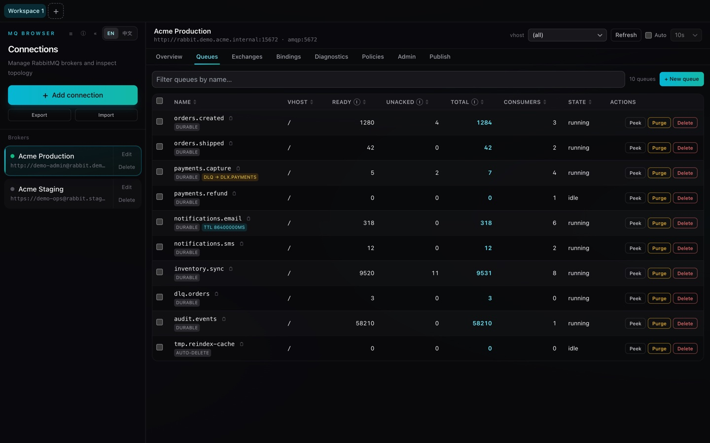
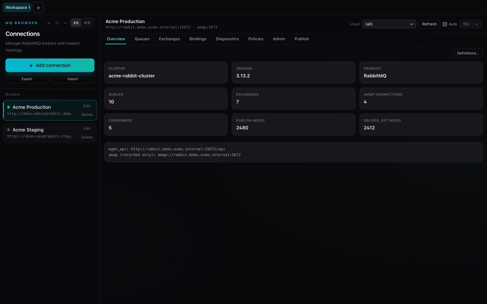
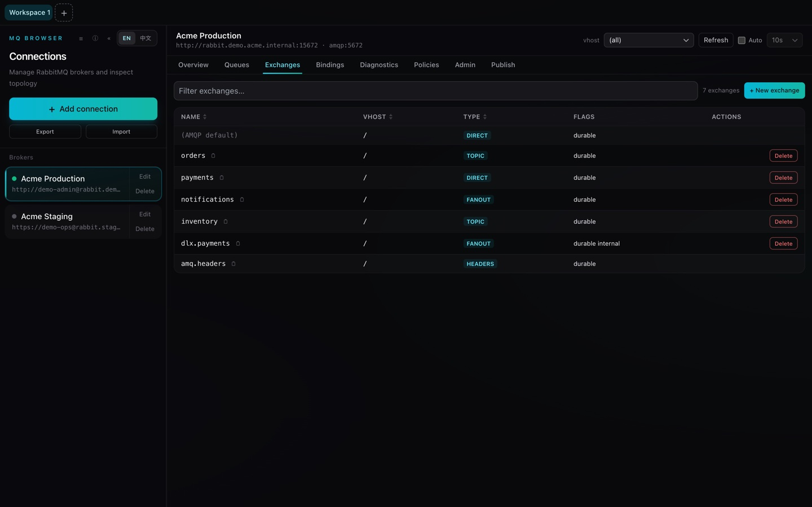
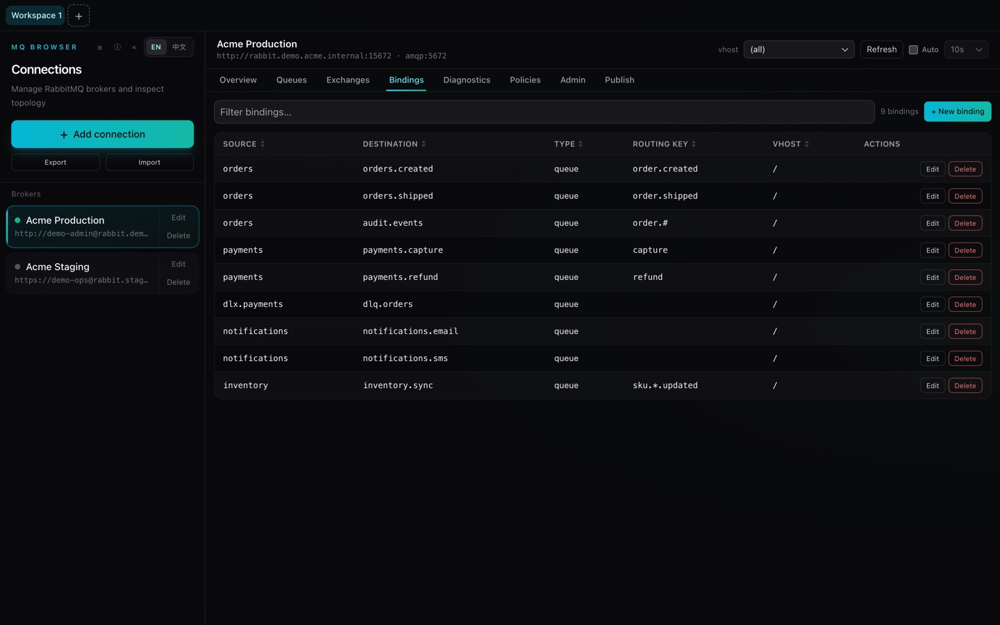
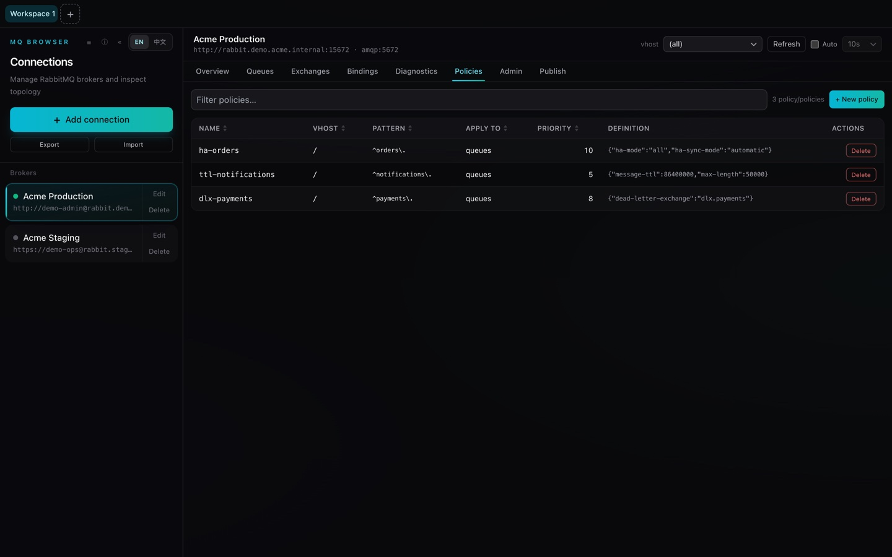
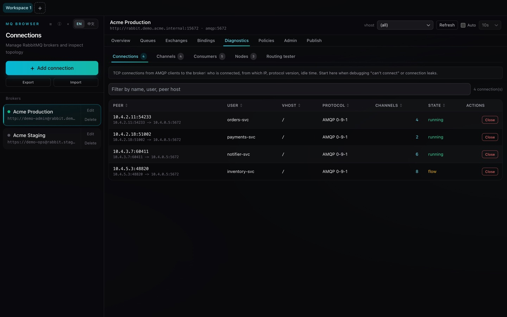
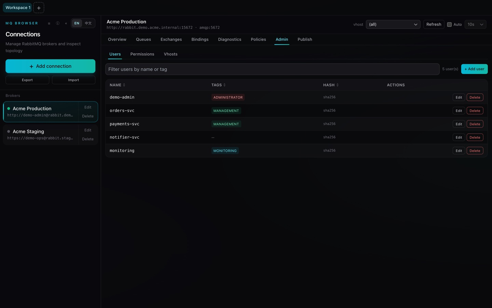
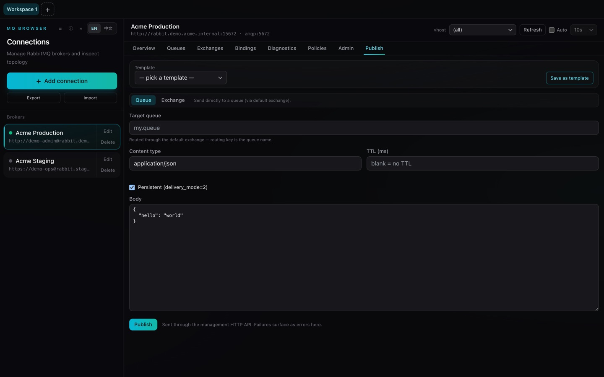
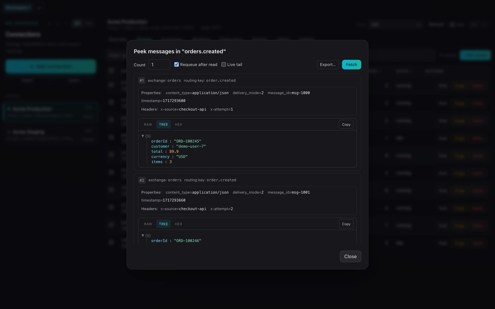

# MQ Browser

> [简体中文](./README.md) | [English](./README.en.md)

A cross-platform **Tauri + TypeScript** desktop app for managing RabbitMQ connections and browsing exchanges, queues, bindings, and messages.

The UI design **references** [MCP-Browser](https://github.com/iGuos/MCP-Browser) — multi-workspace tabs, a connection sidebar, a detail panel, dark mode, and English / Simplified Chinese localization. Only the look and interaction patterns are borrowed; this app has nothing to do with the Model Context Protocol — it manages RabbitMQ.



> All screenshots use fictional **demo data**, not a real broker.

## Overview

MQ Browser is an open-source desktop application developed by Guo's for inspecting and operating RabbitMQ clusters. (It is unrelated to MCP — the MCP-Browser link above is only a UI design reference.) It talks to the broker's **Management HTTP API** to render topology and runtime state, and to publish and peek messages — no long-lived AMQP socket required.

## Core Technologies

- **Frontend**: React 18 + TypeScript + Vite + Tailwind CSS + Zustand
- **Shell**: Tauri 2 (Rust backend)
- **HTTP client**: `reqwest` (rustls) against the RabbitMQ Management API (default port `15672`)
- **i18n**: i18next / react-i18next (English + Simplified Chinese)
- **Persistence**: `tauri-plugin-store` for connections and publish templates

## Key Features

- **Connection Management**: Add, edit, test, and remove RabbitMQ connections; persisted locally via `tauri-plugin-store`, with JSON import / export of the connection list.
- **Multi-Workspace Tabs**: Single workspace by default, or multiple tabs each bound to an independent connection.
- **Topology Browsing**: Vhosts, queues, exchanges, and bindings — with sortable tables and an entity drill-down drawer.
- **Runtime State**: Live connections, channels, and consumers; close connections or channels on demand.
- **Message Inspection**: Peek up to N messages (with optional requeue), view body, properties, and headers.
- **Publish**: Send messages with routing key, properties, headers, and per-message TTL; reusable publish templates.
- **Diagnostics & Routing**: A diagnostics panel with cross-list navigation and linked filters, plus a routing tester to verify how a key would be routed.
- **Cluster Administration**: Manage nodes, policies, users, permissions, and vhosts.
- **Definitions Import / Export**: Back up and restore broker definitions as JSON.
- **Productivity**: Command palette, global shortcuts, auto-refresh, toasts, and dark mode.

## Screenshots

> Fictional demo data — `Acme` broker, sample services, and internal IPs. No real connection is shown.

| Cluster overview | Exchanges |
| --- | --- |
|  |  |

| Bindings | Policies |
| --- | --- |
|  |  |

| Diagnostics — connections / channels / consumers / nodes | Administration — users / permissions / vhosts |
| --- | --- |
|  |  |

| Publish a message | Peek messages (body / properties / headers) |
| --- | --- |
|  |  |

## Development Requirements

- A working **Rust toolchain** (`rustup`)
- **Node.js** 18+ (20 LTS recommended) and **pnpm**
- Platform-specific Tauri prerequisites — see https://v2.tauri.app/start/prerequisites/

```bash
pnpm install
pnpm dev          # tauri dev (full desktop app)
pnpm dev:vite     # vite only (UI in the browser)

VITE_DEMO=1 pnpm dev:vite   # demo mode: render the UI with built-in fixtures, no broker
```

> **Demo mode** (`VITE_DEMO=1`) swaps the Tauri backend for in-memory fixtures
> (`src/lib/demoCore.ts`) so the UI renders in a plain browser — handy for the
> screenshots above. It is off by default and never bundled in normal builds.

## Build

```bash
pnpm build        # tauri build (native bundle)
pnpm build:vite   # tsc + vite build (web assets only)
pnpm typecheck    # tsc --noEmit
```

## Project Structure

```
src/             React UI — stores (Zustand), MQ components, i18n, theme
shared/          Types and constants shared across the TS code
src-tauri/       Rust backend
  src/commands/  Tauri commands: connections, files, management (HTTP), messages
  src/types.rs   Rust-side data types
  src/error.rs   Error handling
scripts/         App-icon generation (generate_icon.py)
```

## Architecture

```
React UI (TypeScript) ──invoke──▶ Rust (Tauri commands) ──HTTP──▶ RabbitMQ Management API
```

The frontend never talks to the broker directly. All network and disk I/O runs in the Rust process; the UI calls type-safe wrappers in `src/lib/tauri.ts` over Tauri's `invoke`.

## Notes

- The broker is reached **only over the Management HTTP API** (default port `15672`). The AMQP port is recorded as display metadata; no AMQP socket is opened.
- Connections are stored locally via `tauri-plugin-store`, and the connection **export JSON contains passwords in plaintext** — keep exported files safe.

## License

[MIT](./LICENSE) © Guo's
