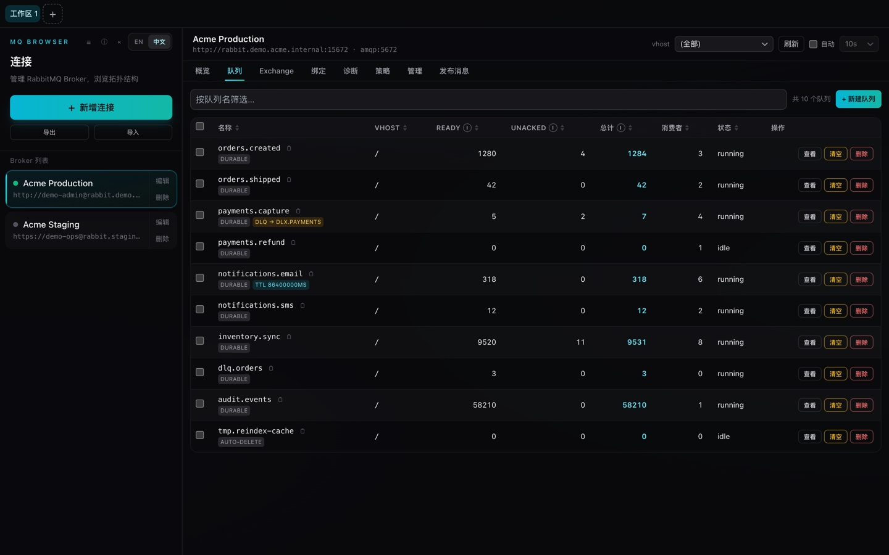
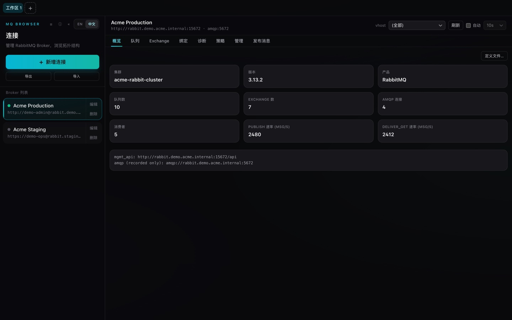
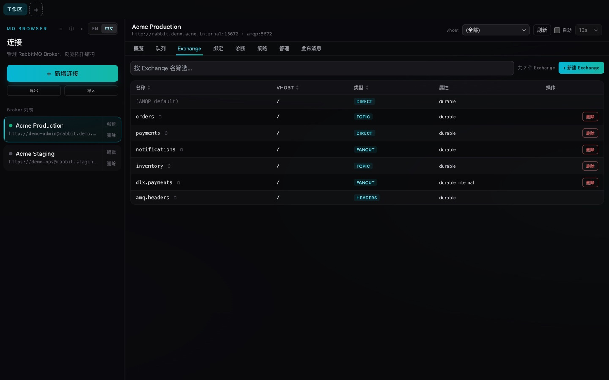
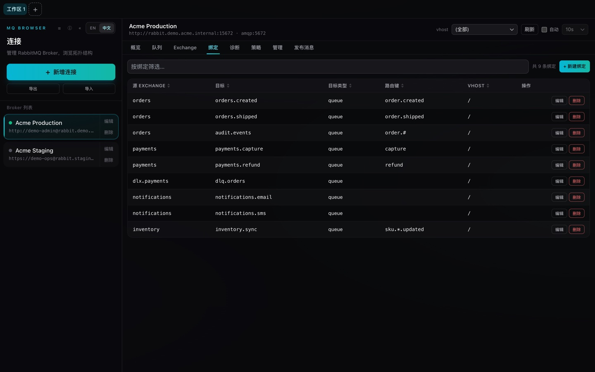
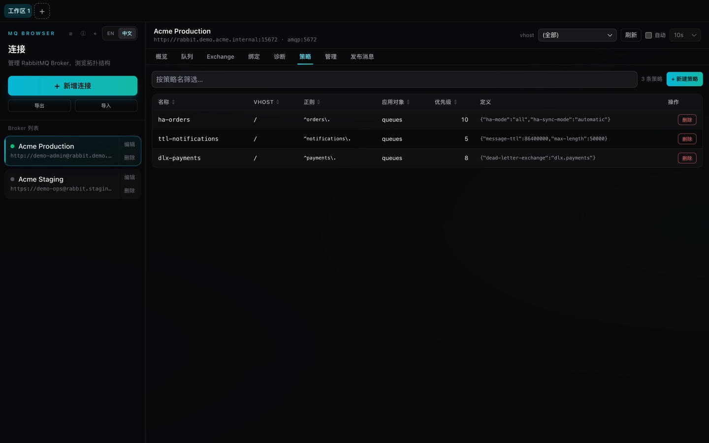
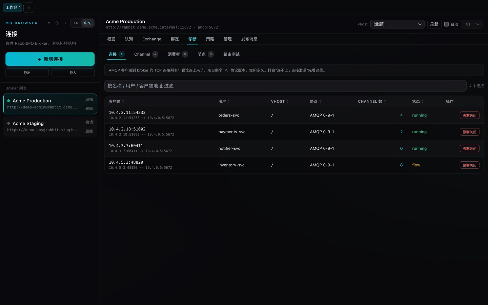
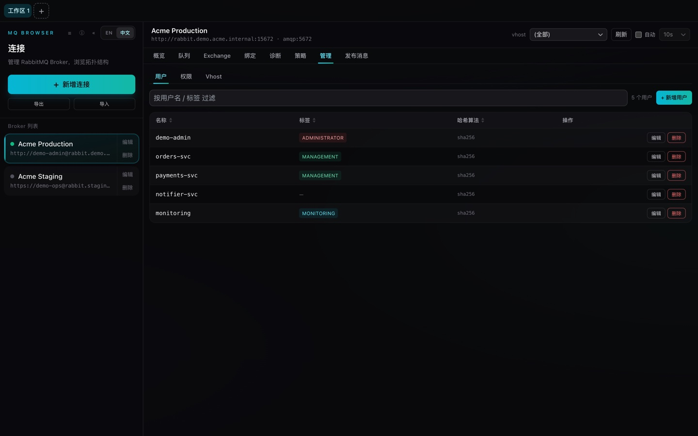
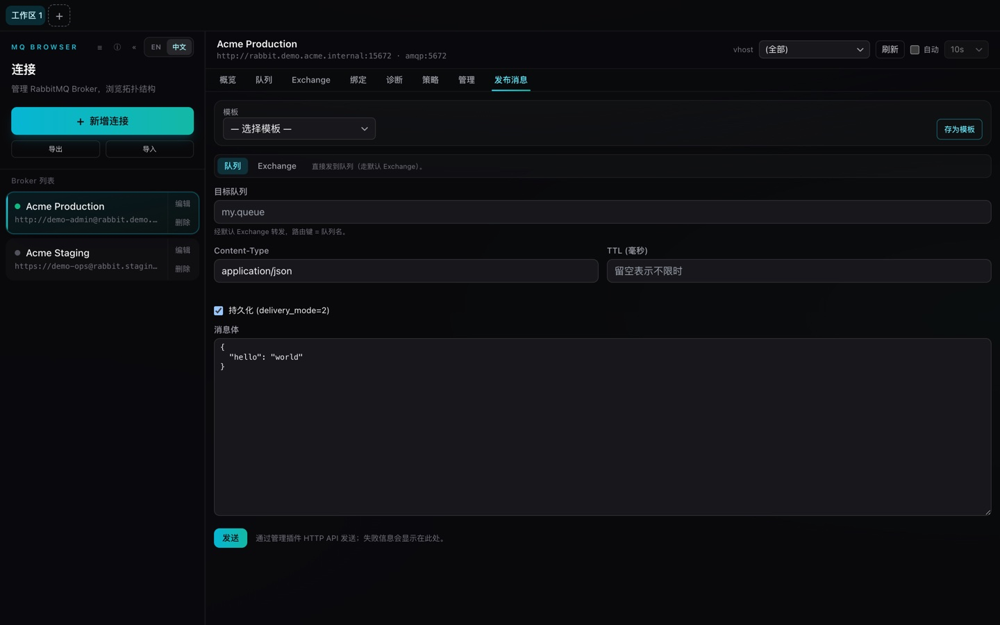
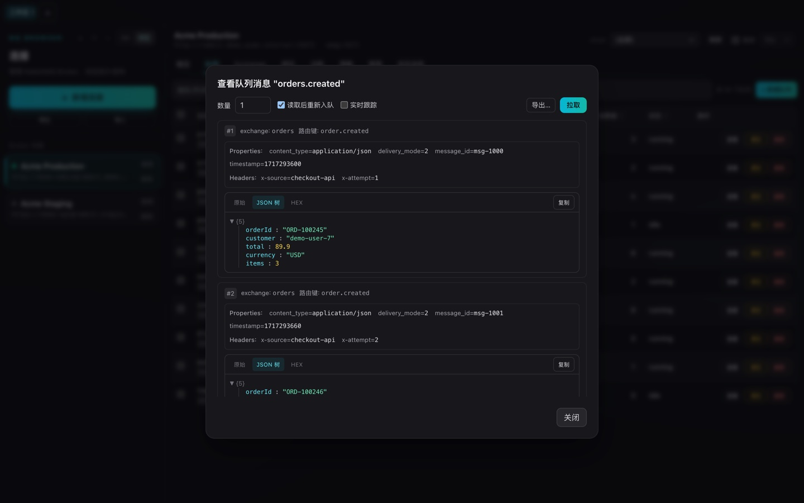

# MQ Browser

> [简体中文](./README.md) | [English](./README.en.md)

一款跨平台的 **Tauri + TypeScript** 桌面应用，用于管理 RabbitMQ 连接，浏览 Exchange、队列、绑定与消息。

界面设计**参考**了 [MCP-Browser](https://github.com/iGuos/MCP-Browser)：多工作区 Tab、连接侧栏、详情面板、深色模式、中英双语。这里只借鉴其外观与交互方式；本应用与 Model Context Protocol（MCP）没有任何关系，它管理的是 RabbitMQ。



> 所有截图均使用**虚构的 demo 数据**，并非真实 broker。

## 概述

MQ Browser 是由 Guo's 开发的开源桌面应用，用于检视和操作 RabbitMQ 集群。（与 MCP 无关 —— 上文的 MCP-Browser 链接仅为界面设计参考。）它通过 broker 的 **Management HTTP API** 来读取拓扑与运行时状态，并完成消息的发布与查看 —— 无需维持长连接的 AMQP socket。

## 核心技术

- **前端**：React 18 + TypeScript + Vite + Tailwind CSS + Zustand
- **外壳**：Tauri 2（Rust 后端）
- **HTTP 客户端**：`reqwest`（rustls），调用 RabbitMQ Management API（默认端口 `15672`）
- **国际化**：i18next / react-i18next（英文 + 简体中文）
- **持久化**：`tauri-plugin-store` 保存连接与发布模板

## 主要功能

- **连接管理**：新增、编辑、测试、删除 RabbitMQ 连接；通过 `tauri-plugin-store` 本地持久化，并支持连接列表的 JSON 导入 / 导出。
- **多工作区 Tab**：默认单工作区，也可开多个 Tab，每个绑定独立连接。
- **拓扑浏览**：Vhost、队列、交换机、绑定 —— 表格支持排序，并提供实体下钻抽屉。
- **运行时状态**：实时查看连接、信道、消费者；按需关闭连接或信道。
- **消息查看**：peek 最多 N 条消息（可选 requeue），查看消息体、属性与 headers。
- **消息发布**：支持路由键、属性、headers 与单条消息 TTL；可复用发布模板。
- **诊断与路由**：诊断面板支持跨列表跳转与联动过滤，并提供路由测试器验证路由键命中情况。
- **集群管理**：管理节点、策略、用户、权限与 Vhost。
- **定义导入 / 导出**：以 JSON 备份与恢复 broker 定义。
- **效率特性**：命令面板、全局快捷键、自动刷新、Toast 提示、深色模式。

## 截图

> 均为虚构 demo 数据 —— `Acme` broker、示例服务与内网 IP，不含任何真实连接。

| 集群概览 | Exchange |
| --- | --- |
|  |  |

| 绑定 | 策略 |
| --- | --- |
|  |  |

| 诊断 —— 连接 / 信道 / 消费者 / 节点 | 管理 —— 用户 / 权限 / Vhost |
| --- | --- |
|  |  |

| 发布消息 | 查看消息（消息体 / 属性 / headers） |
| --- | --- |
|  |  |

## 开发要求

- 已安装 **Rust 工具链**（`rustup`）
- **Node.js** 18+（推荐 20 LTS）与 **pnpm**
- Tauri 对应平台的依赖，参考 https://v2.tauri.app/start/prerequisites/

```bash
pnpm install
pnpm dev          # tauri dev（完整桌面应用）
pnpm dev:vite     # 仅 vite（在浏览器中调试 UI）

VITE_DEMO=1 pnpm dev:vite   # demo 模式：用内置假数据渲染 UI，无需 broker
```

> **Demo 模式**（`VITE_DEMO=1`）会用内存假数据（`src/lib/demoCore.ts`）替换
> Tauri 后端，让 UI 能在普通浏览器中渲染 —— 上方截图即由此生成。默认关闭，
> 正式构建不会打包。

## 构建

```bash
pnpm build        # tauri build（原生安装包）
pnpm build:vite   # tsc + vite build（仅 Web 资源）
pnpm typecheck    # tsc --noEmit
```

## 目录结构

```
src/             React 前端 —— stores（Zustand）、MQ 组件、i18n、主题
shared/          跨 TS 代码复用的类型与常量
src-tauri/       Rust 后端
  src/commands/  Tauri 命令：connections、files、management（HTTP）、messages
  src/types.rs   Rust 侧数据类型
  src/error.rs   错误处理
scripts/         应用图标生成（generate_icon.py）
```

## 架构

```
React UI (TypeScript) ──invoke──▶ Rust (Tauri 命令) ──HTTP──▶ RabbitMQ Management API
```

前端从不直接连 broker。所有网络与磁盘 I/O 都在 Rust 进程中执行；UI 通过 `src/lib/tauri.ts` 中类型安全的封装调用 Tauri 的 `invoke`。

## 说明

- broker **仅通过 Management HTTP API** 访问（默认端口 `15672`）。AMQP 端口仅作为展示用的元数据记录，不会建立 AMQP 连接。
- 连接通过 `tauri-plugin-store` 本地持久化，且连接**导出的 JSON 含明文密码** —— 请妥善保管导出文件。

## License

[MIT](./LICENSE) © Guo's
